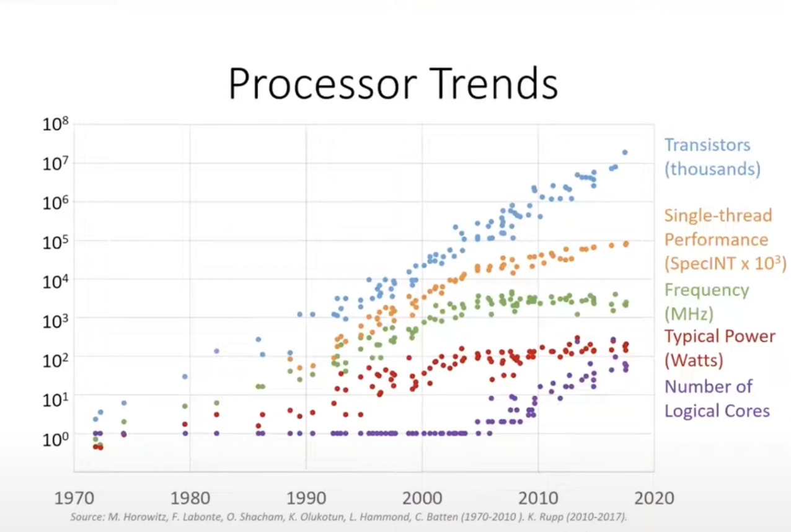
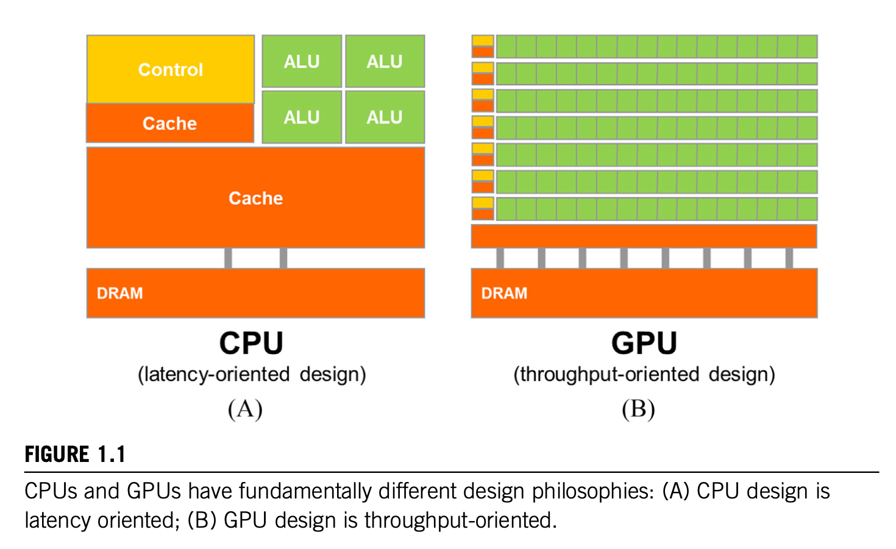

# Introduction

- Since the beginning of computing, it's high value applications have always demanded more execution speed and resources than the computing technology of the time could provide.

- Improvements in hardware design (e.g. increase in clock speed and physical resouces) and  were the primary ways to increase performance in CPUs. This evolution led to the ability of desktop computers to achieve gigaflops (billions of floating-point operations per second) and data centers to reach teraflops (trillions of floating-point operations per second). This also fueled a virtuous cycle of improved user experience and increased demand for computing power. 

## Trends in Processor Design
**Moore’s Law** predicted that the number of transistors per unit area would double every 18-24 months.
- This prediction held true for many years, effectively becoming a self-fulfilling prophecy.
- However, it is now reaching its limits due to the physical constraints of further reducing transistor sizes cost-effectively.
- As transistors became smaller, it became easier to switch them on and off faster, leading to higher clock frequencies in processors. This is because smaller transistors require less voltage and electrons have shorter distances to travel.
- However, around 2005, improvements in clock frequency plateaued due to the Power Law limitation. Increasing the switching speed of transistors leads to higher power consumption, which in turn generates more heat. Excessive heat can damage the CPU if not properly cooled.
- This limitation led to stagnation in single-thread performance except for some improvements due to architecture and compiler optimizations.

### Transition to Multi-core Processors
- We were getting more transistors per unit area, but we could not use them to increase the clock frequency. Instead, chip manufacturers started adding more cores to processors to use the transistors effectively.
- A core is a processing unit that can execute instructions. A CPU with multiple cores can execute multiple instructions simultaneously, which is known as parallelism in computing.
- To use this parallelism effectively, software must be written to take advantage of multiple cores. This is known as parallel programming.
- Free lunch is over: In the past, software developers could rely on hardware manufacturers to increase the clock frequency of processors, leading to automatic performance improvements. However, this is no longer the case. To take advantage of modern hardware, software developers must write parallel code.

### Speedup from Parallelism

- The speedup achieved from parallelism depends on the portion of application that can be parallelized. *Amadahl's Law* gives a theoretical limit on the speedup that can be achieved from parallelism. It is given by the formula:

$$ S = \frac{1}{(1-P) + \frac{P}{N}} $$

where:
- $S$ is the speedup
- $P$ is the portion of the application that can be parallelized
- $N$ is the number of cores

## Design Approaches in Computing

Two design approaches emerged in computing: latency oriented and throughput oriented.

### Latency-oriented Design

- **Latency-oriented design**: This design approach focuses on minimizing the time taken to complete a single task. 
    - It is like a car that can take you from point A to point B quickly. A CPU is an example of a latency-oriented design. 
    - A typical CPU has control logic, arithmetic logic units (ALUs), and cache memory. 
        - The control logic fetches instructions from memory, decodes them, and sends them to the ALUs for execution. 
        - The ALUs perform arithmetic and logical operations on data. 
        - The cache memory stores frequently accessed data and instructions to speed up execution. 
    - CPU generally has a small number of cores (2-64) and a large cache memory (2-64 MB).
    - Larger cache allows to convert long latency memory access to short latency cache access.
    - ALUs on CPU are designed to optimize for latency at the cost of more power consumption and physical space.
    - CPUs also have sophisticated control logic to manage the execution of instructions and data flow.
        - *Branch Prediction*: CPUs have branch prediction logic to reduce control hazards. A control hazard occurs when the CPU has to wait for the result of a branch instruction before it can proceed to the next instruction. Branch prediction logic predicts the outcome of a branch instruction and starts executing the predicted path before the actual result is known.
        - *Out-of-order Execution*: CPUs can execute instructions out of order to maximize the utilization of ALUs. The out of order execution allows execution of an instruction as soon as its operands are available, even if the previous instructions are not completed. This reduces the latency of the program.
        - *Data forwarding*: CPUs have data forwarding logic to reduce data hazards. A data hazard occurs when an instruction depends on the result of a previous instruction. Data forwarding logic forwards the result of an instruction to the dependent instruction before the result is written to the register file.
        - All these control logic requires more power and physical space, which limits the number of cores on a CPU.
    - CPUs employs modest multi-threading to hide memory latency. Multi-threading is a technique where multiple threads are executed simultaneously on the same core. This allows the CPU to switch to another thread when the current thread is waiting for memory access. This hides the memory latency and improves the utilization of the core.
    - High clock frequency allows CPU to execute single thread with low latency.

### Throughput-oriented Design

- **Throughput-oriented design**: This design approach focuses on maximizing the number of tasks completed in a given time. 
    - It is like a bus that can carry many passengers at once at the cost of a longer travel time. 
    - A GPU is an example of a throughput-oriented design.
    - A typical GPU has hundred or thousands of cores and a smaller cache memory. 
    - Smaller cache allows more area dedicated to ALUs.
    - The ALUs on GPU are much much smaller and simpler. 
        - They have typically longer latency. However, there are many more ALUs on a GPU, which allows it to execute many tasks simultaneously and achieve higher throughput.
        - ALUs can be piplined to further increase throughput. ALU pipeline is a technique where multiple ALUs are connected in a sequence, and each ALU performs a different operation on the data. This allows the GPU to execute multiple instructions simultaneously on different data.
    - Similarly simpler control logic in GPUs allows more ALUs to be packed in the same area.
    - GPUs employs massive number of threads to hide the high latency. GPUs don't just have many more cores, but also schedule many more threads per core. This allows the GPU to switch to another thread when the current thread is waiting for memory access or ALU operation or control logic. This hides the latency and improves the utilization of the core.
    - As compared to CPUs, GPUs have moderate clock frequency. This is because GPUs already consume lot more power, so to fit everything in a single chip, clock frequency is kept moderate.

## Origin and Evolution of GPUs

### GPUs for Graphics Processing
- GPUs were originally designed for graphics processing.
- Graphics workloads are often highly parallel e.g rendering a 3D scene involves processing millions of pixels simultaneously.
- This massively parallel nature of graphics workloads led to the development of GPUs with hundreds or thousands of cores.

### GPUs for General-purpose Computing
- In the early 2000s, researchers realized that GPUs could be used for general-purpose computing. However the only way to program GPUs was through graphics APIs like OpenGL and DirectX.
- So to use a GPU for a non-graphics workload, the computation needed to be reformulated as a function that paints pixels on the screen.
- This was a cumbersome process and limited the types of computations that could be offloaded to the GPU.
- NVIDIA came up with CUDA (stands for Compute Unified Device Architecture) in 2007, which allowed developers to write general-purpose programs that could run on the GPU.

## Why GPU (and not other parallel architectures)?
Apart from speed, there are many other reasons why developers and companies adopted GPUs (and not other potential parallel architectures) for general-purpose computing:
- GPUs already had a large user base due to their use in gaming and graphics. Large user base means cost of software development is amortized over a large number of users.
- Chip design and manufacturing is a capital-intensive business, and GPUs were already being manufactured in large quantities for gaming and graphics. This made GPUs cost-effective for general-purpose computing. This gave the GPUs a head start over other potential parallel architectures.
- CUDA led to rise of hybrid computing (discussed later) made GPUs even more attractive for general-purpose computing.

### Rise of Hybrid Computing

- Many software applications today use a combination of CPUs and GPUs to achieve the best performance. For example, a CPU can be used to manage the overall execution of the program, while a GPU can be used to perform the computationally intensive parts of the program.
- CUDA allows developers to write programs that run on both the CPU and GPU seamlessly. This allows developers to take advantage of the strengths of both architectures.
- Developer can write CUDA code using C/C++ and run it on both CPU and GPU. This is possible because CUDA provides a runtime API that abstracts the underlying hardware. The runtime API manages the memory, execution, and synchronization between the CPU and GPU.

## Challenges in parallel computing

- **Algorithm Complexity**: Designing parallel algorithms with the same complexity as sequential algorithms is difficult. Many parallel algorithms perform redundant work especially in case of overlapping subproblems. This can lead to slower execution for large datasets. Techniques like prefix sum can be used to reduce redundant work.

- **Memory Access**: Memory access is a major bottleneck in parallel computing. Memory access latency is the time it takes to read or write data from memory. Memory access bandwidth is the rate at which data can be read from or written to memory. Memory access latency and bandwidth can be improved by using techniques like caching, prefetching, and memory coalescing.

- **Data Characteristics**: The characteristics of the data being processed can affect the performance of parallel algorithms. For example, data that is not uniformly distributed can lead to load imbalance, where some processors have more work to do than others. Data that is not contiguous in memory can lead to poor memory access patterns, which can reduce performance.

## Conclusion
- The transition from single-core to multi-core processors has changed the landscape of computing. Software developers must now write parallel code to take advantage of modern hardware.
- GPUs have emerged as a powerful parallel architecture for general-purpose computing due to their high throughput and large number of cores.
- CUDA has made it easier for developers to write programs that run on both the CPU and GPU, leading to the rise of hybrid computing.

