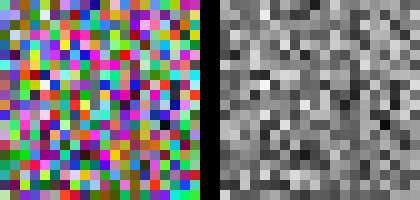
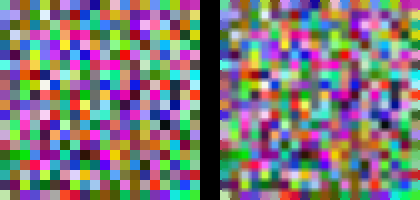

# Multidimensional grids and data

In previous chapter [Heterogeneous Data Parallel Computing](../2_Heterogenous_data_parallel_computing/notes.md) we have seen how to launch a kernel with a one-dimensional grid and block. In this chapter we will see how to launch a kernel with a multidimensional grid and block.

 We will explore multidimensional grid with code of these three examples:
 1. RGB to grayscale conversion
 2. Image Blurring
 3. Matrix multiplication

## RGB to grayscale conversion
- A colored image has 3 channels: Red, Green, Blue. Each channel has a value between 0 and 255.
- A grayscale image has only one channel with a value between 0 and 255 which represents the intensity of the pixel.
- We want to convert a colored image to a grayscale image.
- The formula to convert a pixel from RGB to grayscale is:
    - gray_pixel = 0.299 * R + 0.587 * G + 0.114 * B



- To parallelize this operation, we can assign each thread to a pixel in the image.
- Image is an multi-dimesional array, so it would be great for our threads to have multi-dimensional indices.
- CUDA supports multidimensional grids and blocks (upto 3 dimensions).
    - This simplifies processing multi-dimensional data like the rgb conversion to grayscale above.
- The grid in this case can be 2D, with each block being 2D as well.
- Let's see the code for how to call such a kernel.

```cpp

// Assume red, green, blue are arrays of size width * height already copied to device memory
// gray is an array of size width * height where the result will be stored

dim3 numThreadsPerBlock(32, 32); // 32x32 threads per block
dim3 numBlocks((width + numThreadsPerBlock.x - 1)/numThreadsPerBlock.x, (height + numThreadsPerBlock.y - 1)/numThreadsPerBlock.y);
rgb_to_grayscale_kernel<<<numBlocks, numThreadsPerBlock>>>(red_d, green_d, blue_d, gray_d, width, height);
```

So, the kernel will be launched with a 2D grid and 2D block. Each thread will be responsible for converting one pixel from RGB to grayscale.
This maps to the 2D image perfectly.

### Indexing
Similar to 1D grid, we can calculate the index of a thread in a 2D grid to determine which pixel it will work on (or which element in a 2D array it will work on). We can use the keyword `blockIdx` and `threadIdx` to get the index of the block and thread in the grid and block respectively.

```cpp
int x = blockIdx.y * blockDim.y + threadIdx.y;
int y = blockIdx.x * blockDim.x + threadIdx.x;
```

### Row major order

Even though data appears to be 2D, it is stored in memory as a 1D array. So, we need to access the data in row major order.
- Elements in the same row are stored next to each other in memory.
- So, we need to calculate the index of the pixel in the 1D array using the formula `index = x * width + y`.

Then pixel can be accessed as `red[x * width + y]`, `green[x * width + y]`, `blue[x * width + y]` and `gray[x * width + y]`.

### Putting all of this together
```cpp
__global__ void rgb_to_grayscale_kernel(unsigned char *red, unsigned char *green, unsigned char *blue, unsigned char *gray, int width, int height) {
    int x = blockIdx.y * blockDim.y + threadIdx.y;
    int y = blockIdx.x * blockDim.x + threadIdx.x;

    if(x < height && y < width) {
        int index = x * width + y;
        gray[index] = 0.299 * red[index] + 0.587 * green[index] + 0.114 * blue[index];
    }
}

void rgb_to_grayscale(unsigned char *red, unsigned char *green, unsigned char *blue, unsigned char *gray, int width, int height) {
    unsigned char *red_d, *green_d, *blue_d, *gray_d;
    cudaMalloc(&red_d, width * height * sizeof(unsigned char));
    cudaMalloc(&green_d, width * height * sizeof(unsigned char));
    cudaMalloc(&blue_d, width * height * sizeof(unsigned char));
    cudaMalloc(&gray_d, width * height * sizeof(unsigned char));

    cudaMemcpy(red_d, red, width * height * sizeof(unsigned char), cudaMemcpyHostToDevice);
    cudaMemcpy(green_d, green, width * height * sizeof(unsigned char), cudaMemcpyHostToDevice);
    cudaMemcpy(blue_d, blue, width * height * sizeof(unsigned char), cudaMemcpyHostToDevice);

    dim3 numThreadsPerBlock(32, 32); // 32x32 threads per block
    dim3 numBlocks((width + numThreadsPerBlock.x - 1)/numThreadsPerBlock.x, (height + numThreadsPerBlock.y - 1)/numThreadsPerBlock.y);
    rgb_to_grayscale_kernel<<<numBlocks, numThreadsPerBlock>>>(red_d, green_d, blue_d, gray_d, width, height);

    cudaMemcpy(gray, gray_d, width * height * sizeof(unsigned char), cudaMemcpyDeviceToHost);

    cudaFree(red_d);
    cudaFree(green_d);
    cudaFree(blue_d);
    cudaFree(gray_d);
}
```
## Image Blurring

Let's consider another example. We want to blur the image. Blurring is often used to reduce noise in an image. The idea is to replace each pixel with the average of its neighbors. The neighbors can be defined in a 3x3 grid around the pixel.



- Just like the RGB to grayscale conversion, we can assign each thread to an output pixel, and also have it read the neighboring pixels.
- We can use a 2D grid and 2D block to process the image.
- The kernel will look like this:

```cpp
__global__ void blur_image_kernel(unsigned char* input, unsigned char* output, int width, int height) {
    int row = blockIdx.y * blockDim.y + threadIdx.y;
    int col = blockIdx.x * blockDim.x + threadIdx.x;

    if (row < height && col < width) {
        int count = 0;
        int sum = 0;
        for (int i = -BLUR_SIZE; i <= BLUR_SIZE; ++i) {
            for (int j = -BLUR_SIZE; j <= BLUR_SIZE; ++j) {
                int curRow = row + i;
                int curCol = col + j;
                if (curRow >= 0 && curRow < height && curCol >= 0 && curCol < width) {
                    sum += input[curRow * width + curCol];
                    count++;
                }
            }
        }
        output[row * width + col] = sum / count;
    }
}

void blur_image_gpu(unsigned char* input, unsigned char* output, int width, int height) {
    unsigned char* d_input, *d_output;
    cudaMalloc(&d_input, width * height * sizeof(unsigned char));
    cudaMalloc(&d_output, width * height * sizeof(unsigned char));

    cudaMemcpy(d_input, input, width * height * sizeof(unsigned char), cudaMemcpyHostToDevice);

    dim3 block(32, 32);
    dim3 grid((width + block.x - 1) / block.x, (height + block.y - 1) / block.y);
    blur_image_kernel<<<grid, block>>>(d_input, d_output, width, height);

    cudaMemcpy(output, d_output, width * height * sizeof(unsigned char), cudaMemcpyDeviceToHost);

    cudaFree(d_input);
    cudaFree(d_output);
}
```

Pretty straightforward. In each thread, we are calculating the average of the neighbors of the pixel and storing it in the output image.

## Matrix Multiplication

Let's consider another example. We want to multiply two matrices. Matrix multiplication is a common operation in linear algebra. The idea is to multiply each row of the first matrix with each column of the second matrix to get the result.
- As before, we can assign each thread to an output element.
- In each thread, we find the row from the first matrix and the column from the second matrix that we need to multiply.
- We can use a 2D grid and 2D block to process the matrices.
- The kernel will look like this:

```cpp
__global__ void mat_mul_kernel(int *A, int* B, int* C, unsigned int m, unsigned int n, unsigned int p) {
    int row = blockIdx.y * blockDim.y + threadIdx.y;
    int col = blockIdx.x * blockDim.x + threadIdx.x;

    if (row < m && col < p) {
        C[row * p + col] = 0;
        for (unsigned int i = 0; i < n; i++) {
            C[row * p + col] += A[row * n + i] * B[i * p + col];
        }
    }
}


void mat_mul_gpu(int *A, int* B, int* C, unsigned int m, unsigned int n, unsigned int p) {
    int *d_A, *d_B, *d_C;
    cudaMalloc(&d_A, m * n * sizeof(int));
    cudaMalloc(&d_B, n * p * sizeof(int));
    cudaMalloc(&d_C, m * p * sizeof(int));

    cudaMemcpy(d_A, A, m * n * sizeof(int), cudaMemcpyHostToDevice);
    cudaMemcpy(d_B, B, n * p * sizeof(int), cudaMemcpyHostToDevice);

    dim3 block(32, 32);
    dim3 grid((p + block.x - 1) / block.x, (m + block.y - 1) / block.y);

    mat_mul_kernel<<<grid, block>>>(d_A, d_B, d_C, m, n, p);

    cudaMemcpy(C, d_C, m * p * sizeof(int), cudaMemcpyDeviceToHost);

    cudaFree(d_A);
    cudaFree(d_B);
    cudaFree(d_C);
}
```
## Conclusion
- We have seen how to launch a kernel with a 2D grid and block.
- We explored 2-D grids and blocks with examples of RGB to grayscale conversion, image blurring and matrix multiplication.