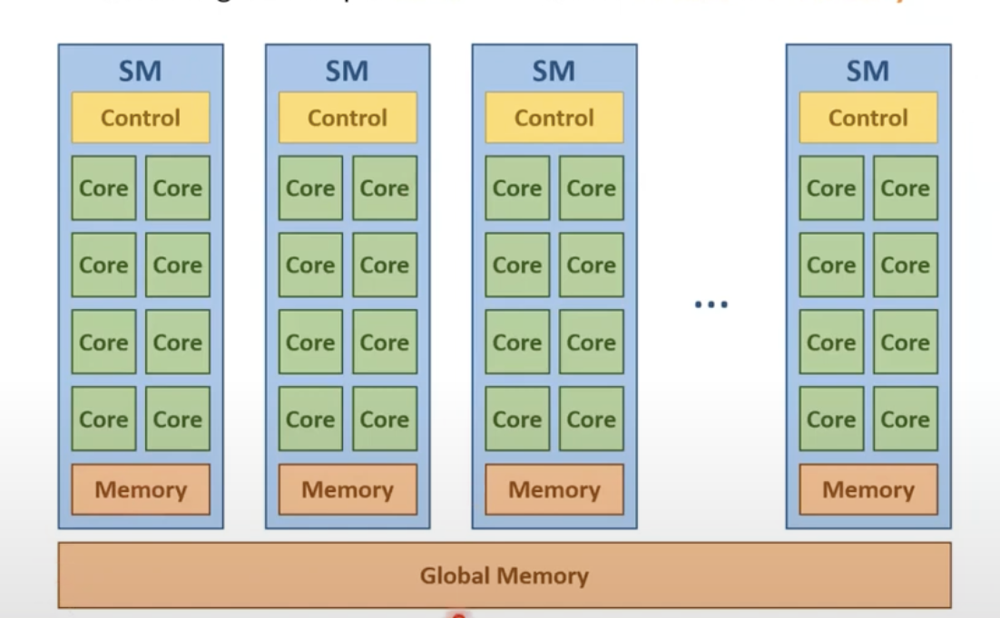
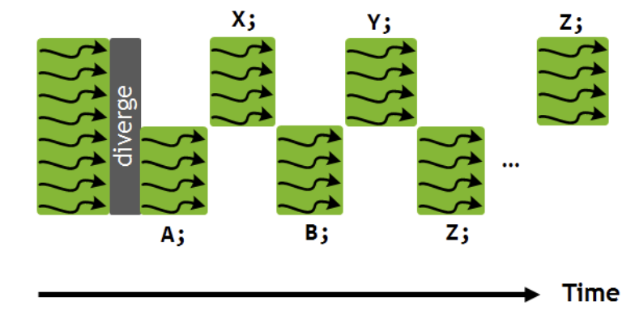
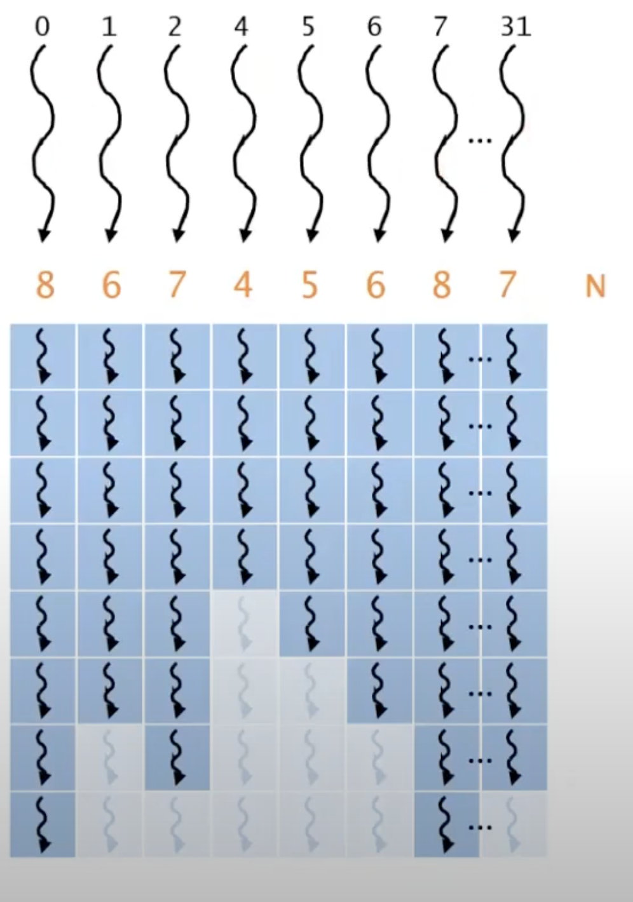
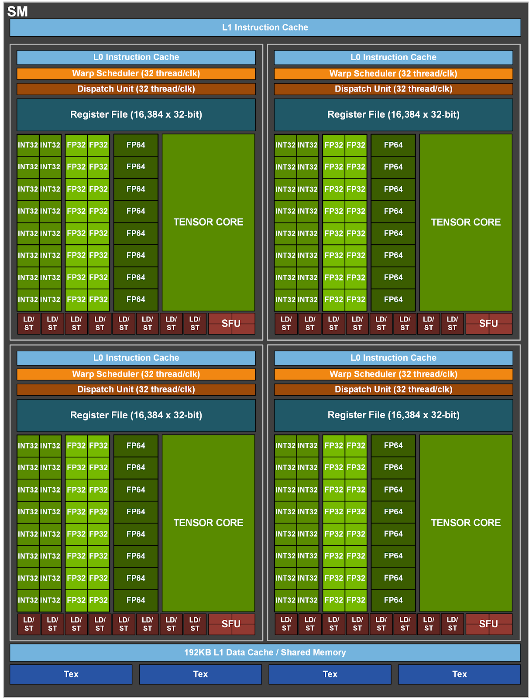
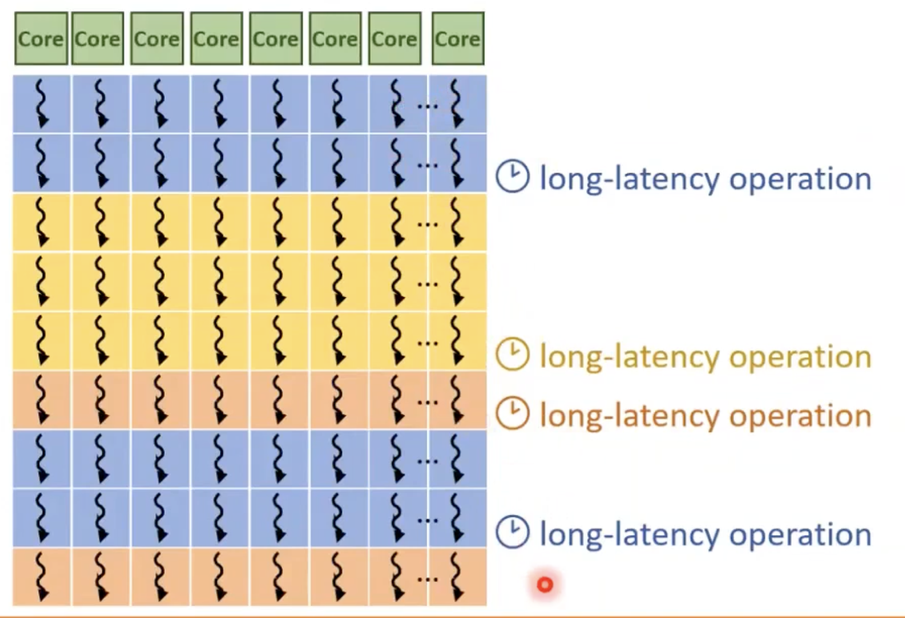

# GPU Architecture

- A GPU consists of multiple **Streaming Multirocessors (SMs)**.
- Each SM consists of multiple **CUDA cores**. A core is the unit that executes arithmetic operations.
- These cores in SM shares a memory called **shared memory**.
- These cores in SM also share a **control logic**.
- All the SMs have access to a **global memory**.
- Global memory is where we have been copying data from host (CPU) to device (GPU) using `cudaMemcpy`.
 
 

- An NVIDIA Tesla T4 GPU has 40 SMs and each SM has 64 CUDA cores. So in total we have 2560 CUDA cores.

## Assigning work to GPU
- Threads are grouped in block (1D, 2D, 3D - Discussed in previous chapter).
- Recall that a block is a logical group of threads and we use `<<<num_blocks, num_threads_per_block>>>` syntax to launch a kernel.
- Threads in a block are executed by a single SM. In other words, all threads in a block are executed by a single SM.
- Note that we can have multiple thread blocks get assigned to same SM. However we can't have some threads in one block assigned to one SM and some threads in another block assigned to another SM.
- Threads when run on SM, they require resources e.g. registers, memory, some slots for thread specific control data etc
- So SMs can only run a limited number of threads/blocks at a time and thus we only have a limited number of thread blocks getting executed simultaneously.
- When we launch a kernel, a grid of threads is launched. A grid contain thread blocks. The number of blocks in the grid can exceed the total number of blocks that can be executed simultaneously. In that case, the remaining blocks wait for other blocks to finish execution before they can be assigned to an SM.

## Syncronization
- Threads in the same block can collaborate and communicate in ways that threads in different blocks cannot.
- Threads in the same block can synchronize using `__syncthreads()` function. This is called **barrier synchronization**.
    -  Wait for all threads in a block to reach the barrier before any of them proceeds past it.
- Another way the threads in same block collaborate is by using **shared memory**. (To be elaborated later)
    - Access to a fast memory shared by all threads in the same block.

## Scheduling Considerations
- As discussed earlier, threads in a block are executed by a single SM. This makes supporting collaboration between threads efficient.
- Also, all threads in a block assigned to SM simultaneously. 
- A block cannot be assigned to an SM if all the resources required by the block are not available.
    - So if an SM has 256 slots free, but there are 512 threads in a block, that means we can't run that block on that SM.
    - If it is allowed, we can have deadlock. For example if 256 of the 512 threads in the block are executing, while other 256 are waiting to be scheduled on the same SM. If first 256 threads reach a barrier, they will wait for other 256 threads to reach the barrier. On the other hand, other 256 threads are waiting to be scheduled on the SM and may be waiting for the first 256 threads to finish. This is a deadlock.

## Transparent Scalability
- Threads in different blocks do not synchronize. In other words, threads in different blocks do not collaborate. Blocks are independent of each other.
- This allows blocks to execute in any order and on any SM.
- This also means blocks can execute in parallel or sequentially with respect to each other.
- This allows different GPU architectures to execute the same code with different amounts of parallelism.
    - If device has more SMs, more blocks can be executed simultaneously.
    - If device has less SMs, blocks will be executed sequentially.
    - This is called **transparent scalability**.
- Programmers don't have to worry about how many SMs are there in the device. They just write the code and the code will run on any device with any number of SMs.
- Programmers often don't need to worry about the architecture of CPUs too but for different reasons. In CPUs threads can synchronize and collaborate. CPU allows context switching between threads. However due to massive parallelism in GPUs, context switching is not feasible. Hence, the restriction on threads in different blocks not to synchronize.

## Thread Scheduling
Now, lets focus on what happens on one SM when a block is assigned to it.
- Each SM has a **scheduler** that manages the execution of threads.
- Threads assigned to an SM run concurrently (not that it doesn't mean they run in parallel, it means that scheduler switches between threads to give an illusion of parallelism).
- The scheduler selects a block to execute and then selects a **warp** (a group of 32 threads) from that block.

### Warps
- Warps are the unit of scheduling and execution on the SM.
- Size of the warps is device specific, although it has always been 32 threads till now.
- Threads in a warp are scheduled together and executed following **SIMD (Single Instruction, Multiple Data)** model.
- This means that all threads in a warp execute the same instruction at the same time however all these threads will be working on different data. (We will discuss what happenes during branching)
- The advantage of that is instruction fetch and decode is done only once for the warp. This reduces amount of control logic required and thus saves power and real estate.
- The disadvantage is that if threads in a warp have different execution paths, some threads will be idle while others are executing. This is called **control divergence**.
```cpp
if(threadIdx.x % 2 == 0) {
    A;
    B;
} else {
    X;
    Y; 
}
```
- In the above code, if `threadIdx.x` is even, the first branch will be executed (A and B) by half of the threads while other half will be idle. Similarly, if `threadIdx.x` is odd, the second branch will be executed (X and Y) by half of the threads while other half will be idle.


- This is not a problem in CPUs because CPUs can context switch between threads i.e. if one thread is waiting for some data, CPU can switch to another thread. However, in GPUs, threads in a warp are executed concurrently and thus if some threads are waiting, other threads will be idle. Context Switching is not feasible in GPUs due to massive parallelism.

Another example of control divergence:
```cpp
int N = a[threadIdx.x];
for (int i = 0; i < N; i++) {
    A;
}
```


In the loop, some threads may have to execute the loop more times than others. This will cause some threads to be idle while others are executing the loop.

Programmers need to be aware of control divergence and try to minimize it. We will discuss how to minimize control divergence in later chapters.

## Architecture of Streaming Processor (SM)



- The diagram shows A100 SM architecture. It has 128 SMs and each SM has 4 processing blocks. Let's explore the components of the streaming multiprocessor:
- SM can also be divided into multiple **processing blocks**.

- **Processing Blocks**: Processing Blocks are the units that execute the instructions. Each processing block has its own set of execution units. In the diagram above for A100 GPU, we have:
    - 16 FP32 CUDA cores per processing block.
    - 16 INT32 CUDA cores per processing block.
    - 8 FP64 CUDA cores per processing block.
    - 2 Tensor cores per processing block.
    - 8 Load/store units per processing block.
    - 1 Special Function Units (SFU) per processing block.
- Each processing block has its own scheduler, register file, instruction cache, dispatch unit etc.
- **Shared memory/L1 Data cache**: Shared memory is a fast memory shared by all processing blocks in the SM. It is used for communication between threads in the same block. It is also used as a cache for global memory.
- **L0 Instruction cache**: Stores instructions to be executed by the executing units within a processing block. Each processing block has its own L0 instruction cache.
- **Warp Scheduler**: Schedules warps to the execution units. A warp is executed by a single processing block. In other words, all threads in a warp are executed by a single processing block.
- **Dispatch unit**: Fetches instructions from the instruction cache and dispatches them to the execution units within the processing block.
- **Register file**: Stores the registers for the threads within a processing block.
- **Execution units**: Execute the instructions within the processing block. They can be of different types like:
    - FP32 CUDA cores: Execute 32 bit floating point operations also known as single precision operations.
    - INT32 CUDA cores: Execute 32 bit integer operations.
    - FP64 CUDA cores: Execute 64 bit floating point operations also known as double precision operations.
    - Tensor cores: Specialized units for matrix operations (essential for deep learning workloads).
    - Load/store units: Handles memory operations within including loading data to and from the memory.
    - Special Function Units (SFU): Execute special functions like trigonometric functions, exponential functions etc.
- **Tex units**: Texture units are used for texture mapping in graphics workloads.

## Latency Hiding
- GPUs are designed for high throughput. They are designed to hide the latency of memory operations.
- When a thread  in a warp is waiting for data from memory, the scheduler switches to another warp and executes it.
- This way, the execution units are kept busy and the latency of memory operations is hidden.
- This is called **latency hiding**.

- For latency hiding to work, ideally there should be lot more warps to hide long latency operations. With lot more warps, there is a high probability that some warp will be ready to execute when the current warp is waiting for data from memory.
- For this reason, Streaming Multiprocessors (SMs) support many more threads than the number of execution units. Volta V100 supports 2048 threads per SM while there are 64 cores per SM.  Remember that a single core can execute only one thread at a time. So, if a thread is waiting for data from memory, the core will be idle. However, the scheduler can switch to another warp and execute it on another core. This way, the execution units are kept busy and the latency of memory operations is hidden.

### Occupancy
- Occupancy is the measure of how well the GPU is utilized.
- Occupancy of an SM refers to the ratio of active warps to the maximum number of warps that can be executed simultaneously on the SM.
- Higher occupancy is desirable because it means that the SM is being utilized to its full potential and it improves the latency hiding.
- Occupancy can be increased by increasing the number of threads per block, increasing the number of blocks per SM, reducing the amount of shared memory used by each block etc.
- How we choose the block size and number of blocks per SM can affect the occupancy. Let's take an example of volta V100, it has the following specifications:
    - Max threads per SM: 2048
    - Max blocks per SM: 32
    - Max threads per block: 1024

- If we launch a kernel with 256 threads per block, we can have 8 blocks per SM (which is less than max 32 blocks). This will result in 8 * 256 = 2048 threads per SM. This will result in 100% occupancy.

- If we launch a kernel with 32 threads per block, we can have 64 blocks per SM (which is more than max 32 blocks). So we will cap the number of blocks to 32. This will result in 32 * 32 = 1024 threads per SM. This will result in 50% occupancy.

- If we launch a kernel with 768 threads per block, occupancy will be limited because 2048 is not divisible by 768. So, we will have 2 blocks per SM. The remaining of 512 threads will not be utilized.

- So, we need to choose the block size and number of blocks per SM carefully to maximize the occupancy.

How to know properties of a device programmaically:
```cpp
int device = 0;
cudaDeviceProp prop;
cudaGetDeviceProperties(&prop, device);
int maxThreadsPerBlock = prop.maxThreadsPerBlock;
int maxThreadsPerMultiProcessor = prop.maxThreadsPerMultiProcessor;
``` 

# Summary
- A GPU consists of multiple Streaming Multiprocessors (SMs).
- Each SM consists of multiple CUDA cores.
- Threads are grouped in blocks and blocks are executed by SMs.
- Threads in a block can synchronize and collaborate.
- Threads in different blocks are independent of each other.
- Transparent scalability allows the same code to run on different GPU architectures.
- Threads in a warp are executed concurrently following SIMD model.
- Control divergence can cause some threads to be idle while others are executing.
- SMs are designed for high throughput and hide the latency of memory operations.
- Occupancy is the measure of how well the GPU is utilized. Higher occupancy is desirable.


