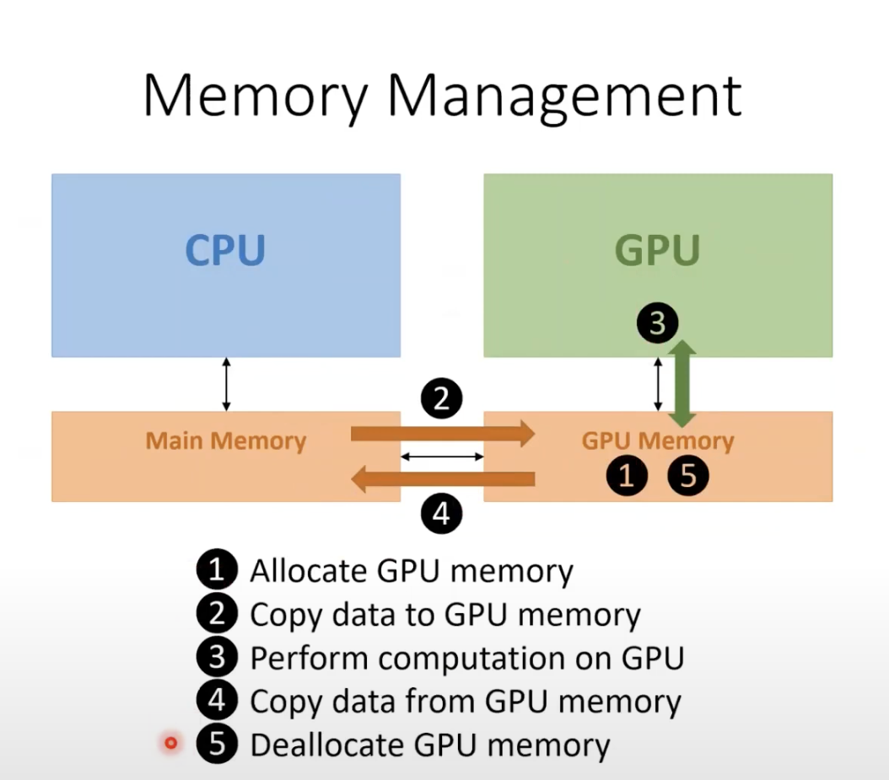
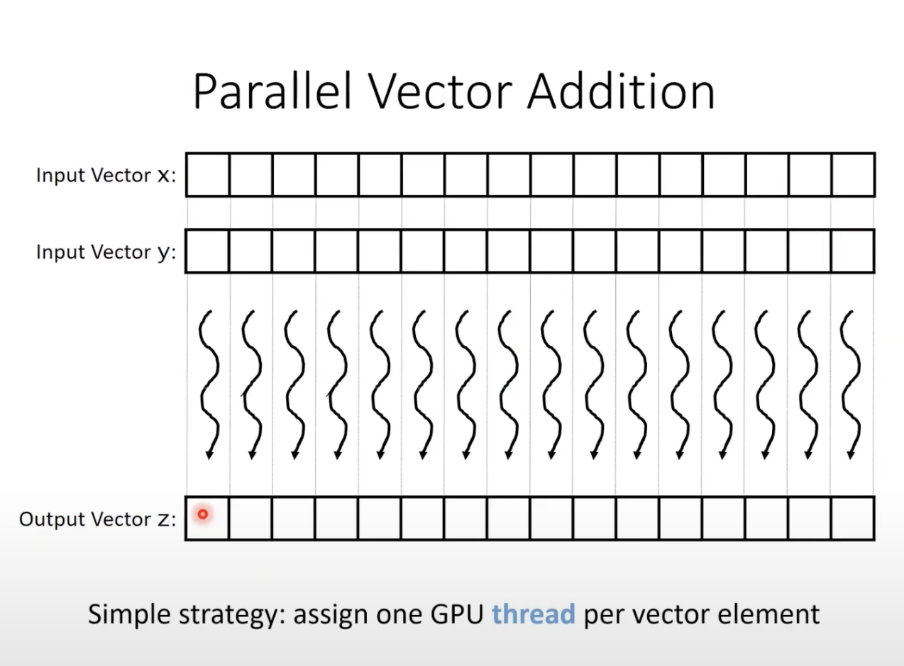
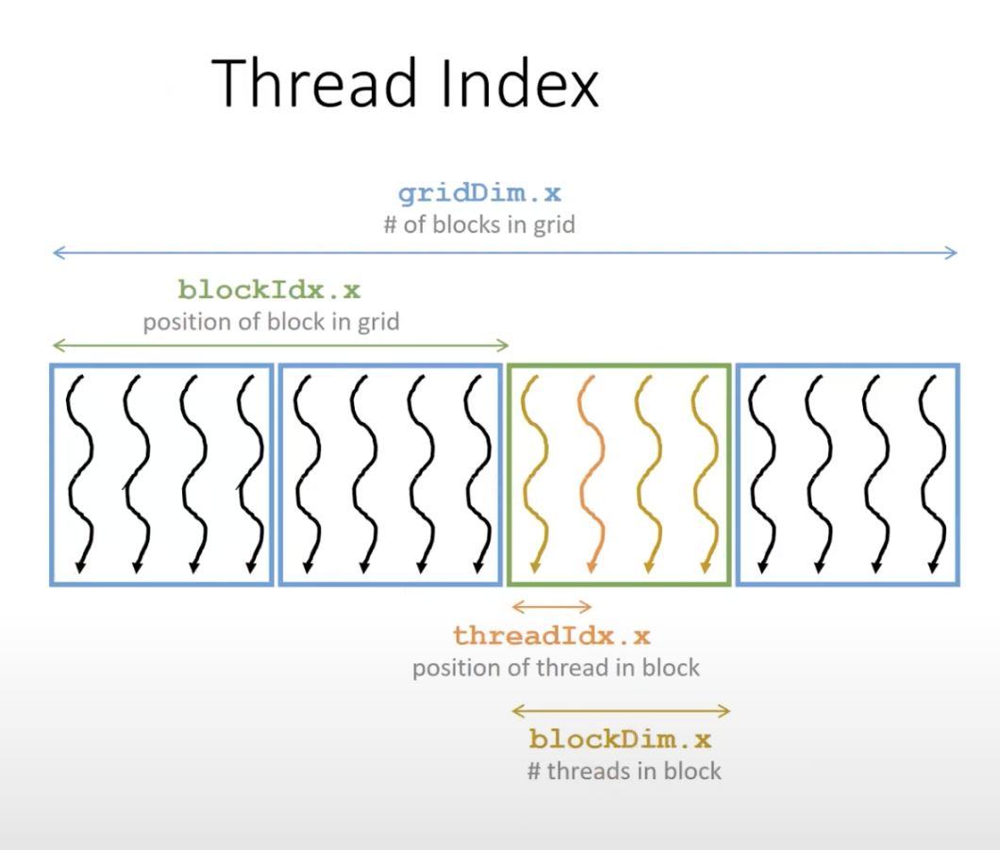

# Data Parallel Programming

There are two types of parallelism in computing: **Data Parallelism** and **Task Parallelism**. In this chapter, we will focus on **Data Parallelism**.

## Types of Parallelism
- **Data Parallelism**: The same operation is performed on different data.
    - A good example is rendering a 3D scene. Each pixel is rendered independently.
    - Massive amount of parallelism can be exploited suitable for GPUs.
    - Usually programmer doesn't need to write lot more code to exploit this parallelism. Same functions are called with different data.
    - The data is divided into chunks and each chunk is processed by a different thread.

- **Task Parallelism**: Different operations are performed on same or different data.
    - A good example is spell checker running parallely to other word processing tasks like typing.
    - Programmer needs to define the tasks and dependencies between them explicitly and thus modest amount of parallelism can be exploited.

An application can have both types of parallelism. For example, a 3D game can have data parallelism for rendering and task parallelism for different game tasks like handling user input, physics, AI etc.

In this chapter, we will explore CUDA to write programs that exploit data parallelism.

## Vector Addition

The simplest example of data parallelism is adding two vectors. The operation is simple: `C[i] = A[i] + B[i]`. Let's look at how we can implement this in CPU first.

```cpp
// A simple function to add two vectors
// A, B and C are vectors of size n
void vec_add(float *A, float *B, float *C, int n) {
    for (unsigned int i = 0; i < n; i++) {
        C[i] = A[i] + B[i];
    }
}
```
For a CPU, this is a simple loop that adds two vectors. But for a GPU, we can exploit the massive parallelism available. We can add each element of the vector in parallel. Before we write the kernel, let's look at how memory is managed in CUDA.

## Memory Management in CUDA
The `A`, `B` and `C` in the above code is allocated in CPU memory. The GPU has its own memory and _usually_ CPU memory is not accessible to GPU and vice versa. So, we need to allocate memory in GPU and copy data from CPU to GPU memory before we can perform any operation on it.



The memory management in CUDA is as follows:
1. Allocate memory in GPU using `cudaMalloc()`.
2. Copy data from CPU to GPU using `cudaMemcpy()`.
3. Perform operations on GPU.
4. Copy data back to CPU using `cudaMemcpy()`.
5. Free memory in GPU using `cudaFree()`.

There are some ways to make the above memory management optimized (to be discussed in future chapters). 

Let's explore these concepts in detail with the vector addition example.

## Allocating Memory in GPU
To allocate memory in GPU, we use `cudaMalloc()`. The function takes a pointer to the memory location and the size of memory to be allocated. The function returns `cudaError_t` which is `cudaSuccess` if the memory is allocated successfully.

```cpp
cudaError_t cudaMalloc(void **devPtr, size_t size);
```
To allocate memory for `A`, `B` and `C` in the above example, we can do the following:
```cpp
float *d_A, *d_B, *d_C;
cudaMalloc( (void**)&d_A, n * sizeof(float));
cudaMalloc((void**)&d_B, n * sizeof(float));
cudaMalloc((void**)&d_C, n * sizeof(float));
``` 
`d_A`, `d_B` and `d_C` are pointers to the memory allocated in GPU. We are skipping error checking for simplicity. In a real program, you should check the return value of `cudaMalloc()`.

## Deallocating Memory in GPU
To deallocate memory in GPU, we use `cudaFree()`. The function takes the pointer to the memory location in GPU.

```cpp
cudaError_t cudaFree(void *devPtr);
```
To deallocate memory for `A`, `B` and `C` in the above example, we can do the following:
```cpp
cudaFree(d_A);
cudaFree(d_B);
cudaFree(d_C);
```

## Copying Data from CPU to GPU or Vice Versa
To copy data from CPU to GPU or GPU to CPU, we use `cudaMemcpy()`. 

Let's first copy from CPU to GPU. The function takes the destination pointer in GPU, source pointer in CPU, size of data to be copied and the direction of copy (`cudaMemcpyHostToDevice`).

```cpp
cudaError_t cudaMemcpy(void *dst, const void *src, size_t count, cudaMemcpyKind kind);
```
To copy data of `A`, and `B` from CPU to GPU in the above example, we can do the following:
```cpp
cudaMemcpy(d_A, A, n * sizeof(float), cudaMemcpyHostToDevice);
cudaMemcpy(d_B, B, n * sizeof(float), cudaMemcpyHostToDevice);
```
Note that Host in CUDA refers to CPU and Device refers to GPU.So `cudaMemcpyHostToDevice` is used to copy data from CPU to GPU. Similarly, `cudaMemcpyDeviceToHost` is used to copy data from GPU to CPU.

Let's copy data of `C` from GPU to CPU in the above example:
```cpp
cudaMemcpy(C, d_C, n * sizeof(float), cudaMemcpyDeviceToHost);
```

## Performing Operations on GPU
The most obvious way to do vector addition on a GPU is to create as many threads as there are elements in the vector and each thread adds the two corresponding elements.


So Let's explore how threads are organized and launched on a GPU.

### Threads in GPU
An array of threads on the GPU is called a **Grid**. From the CPU, we create a bunch of threads to perform some operation on the GPU. These threads organized into a grid. 

Threads in a grid are further organized into **Blocks**. Threads in a block can collaborate and communicate with each other unlike threads in different blocks. (More on this later)

To launch a grid, we need to specify the number of blocks and number of threads in each block. The number of threads in a block is limited by the GPU architecture. For example, a block can have maximum 1024 threads in CUDA.

### Launching a Grid
Threads in the same grid execute the same function called a **Kernel**. 
A kernel is similar to a function in C/C++ but it is executed on the GPU.
A grid is launched by calling a kernel and configuring it with appropriate number of blocks and threads per block. 

```cpp
kernel_name<<<num_blocks, num_threads_per_block>>>(args);
```
So for our vector addition example, we can launch a kernel as follows:
```cpp
unsigned int num_threads_per_block = 256;
unsigned int num_blocks = (n + num_threads_per_block - 1) / num_threads_per_block;
// We will define the `vec_add_kernel` soon.
vec_add_kernel<<<num_blocks, num_threads_per_block>>>(d_A, d_B, d_C, n);
```

### Writing a Kernel

- Each thread in the grid will execute this same C/C++ like function called kernel. It is preceded by a special keyword `__global__` to indicate that it is a kernel and will be executed on the GPU.

- It uses special following keywords to distinguish different threads from each other:
- `gridDim.x`: number of blocks in the grid
- `blockDim.x`: number of threads in a block
- `blockIdx.x`: index of the block in the grid
- `threadIdx.x`: index of the thread in the block



Thus to get global index of a thread in the grid, we can do the following:

$$
\text{global\_index} = \text{blockIdx.x} \times \text{blockDim.x} + \text{threadIdx.x}
$$

This allows us to map each of these threads to an element in the vector and perform element-wise addition parallely.

```cpp
__global__ void vec_add_kernel(float *A, float *B, float *C, int n) {
    unsigned int global_index = blockIdx.x * blockDim.x + threadIdx.x;
    if (global_index < n) {
        C[global_index] = A[global_index] + B[global_index];
    }
}
```

### Putting it all together
Let's put all the above concepts together to write a simple vector addition program in CUDA.
Note that error checking is skipped for simplicity. In a real program, you should check the return value of CUDA functions.

```cpp
#include <iostream>
#include <cuda_runtime.h>
#include <cstdlib>
#include <cstdio>
#include <ctime>

__global__ void vec_add_kernel(float *A, float *B, float *C, unsigned long long n) {
    unsigned long long i = blockIdx.x * blockDim.x + threadIdx.x;
    if (i < n) {
        C[i] = A[i] + B[i];
    }
}

void vec_add_cpu(float *A, float *B, float *C, unsigned long long n) {
    for (unsigned long long i = 0; i < n; i++) {
        C[i] = A[i] + B[i];
    }
}

void vec_add_gpu(float *A, float *B, float *C, unsigned long long n) {
    // Allocate GPU memory
    float *d_A, *d_B, *d_C;
    cudaMalloc((void**)&d_A, n * sizeof(float));
    cudaMalloc((void**)&d_B, n * sizeof(float));
    cudaMalloc((void**)&d_C, n * sizeof(float));
    
    // Copy data from CPU to GPU
    cudaMemcpy(d_A, A, n * sizeof(float), cudaMemcpyHostToDevice);
    cudaMemcpy(d_B, B, n * sizeof(float), cudaMemcpyHostToDevice);

    // Launch kernel
    unsigned int num_threads_per_block = 512;
    unsigned int num_blocks = (n + num_threads_per_block - 1) / num_threads_per_block;

    clock_t start = clock();
    vec_add_kernel<<<num_blocks, num_threads_per_block>>>(d_A, d_B, d_C, n);
    cudaDeviceSynchronize();
    clock_t end = clock();
    std::cout << "Time taken by GPU kernel: " << (double)(end - start) / CLOCKS_PER_SEC << " seconds" << std::endl;
    // Copy data from GPU to CPU
    cudaMemcpy(C, d_C, n * sizeof(float), cudaMemcpyDeviceToHost);

    // Free GPU memory
    cudaFree(d_A);
    cudaFree(d_B);
    cudaFree(d_C);
}

int main() {
    unsigned long long n = (1ULL << 30);
    float *A = (float*)malloc(n * sizeof(float));
    float *B = (float*)malloc(n * sizeof(float));
    float *C_cpu = (float*)malloc(n * sizeof(float));
    float *C_gpu = (float*)malloc(n * sizeof(float));

    for (unsigned long long i = 0; i < n; i++) {
        A[i] = rand() % 100;
        B[i] = rand() % 100;
    }

    std::cout << "Vector addition of " << n << " elements" << std::endl;

    // Measure time taken by CPU
    clock_t start = clock();
    vec_add_cpu(A, B, C_cpu, n);
    clock_t end = clock();
    std::cout << "Time taken by CPU: " << (double)(end - start) / CLOCKS_PER_SEC << " seconds" << std::endl;

    // Measure time taken by GPU
    start = clock();
    vec_add_gpu(A, B, C_gpu, n);
    end = clock();
    std::cout << "Time taken by GPU: " << (double)(end - start) / CLOCKS_PER_SEC << " seconds" << std::endl;
    std::cout << "Time taken by GPU includes copying data from CPU to GPU, launching kernel, and copying data from GPU to CPU" << std::endl;


    // Check if the results are correct
    for (unsigned long long i = 0; i < n; i++) {
        if (C_cpu[i] != C_gpu[i]) {
            std::cerr << "Error at index " << i << std::endl;
            break;
        }
    }

    free(A);
    free(B);
    free(C_cpu);
    free(C_gpu);
    return 0;
}
```

To compile the above code, you need to have CUDA installed. You can compile the code using `nvcc` which is the CUDA compiler.

```bash
nvcc -o vec_add vec_add.cu
```

`nvcc` splits the code into two parts: one that runs on the CPU and one that runs on the GPU. The code that runs on the CPU is compiled by host compiler (like `g++`) and the code that runs on the GPU is first compiled to PTX (Parallel Thread Execution) code and then it is compiled to device assembly code by device just-in-time compiler. CPU code knows how to launch the GPU code and how to copy data between CPU and GPU.

How does the `nvcc` know which part of the code runs on the CPU and which part runs on the GPU? It does this by keywords on the functions.

- `__global__` keyword is used to indicate that the function runs on the GPU. It is callable from the host(CPU) or device(GPU) and executes on the device(GPU). It is the keyword that is used to define a kernel.

- `__host__` keyword is used to indicate that the function runs on the CPU. It is the default. It is callable from the host(CPU) and executes on the host(CPU).

- `__device__` keyword is used to indicate that the function runs on the GPU. It is callable from the device(GPU) and executes on the device(GPU).

Why do we need `__host__` if it is the default? Consider a function that needs to be called from both CPU and GPU. Instead of creating two functions, one for CPU and one for GPU, we can create a single function and use `__host__` keyword for CPU and `__device__` keyword for GPU.

```cpp
__host__ __device__ void foo() {
// operations
}
```
## How fast is the GPU code?
On running the above code on my machine with an NVIDIA Tesla T4 GPU, I got the following output:
```bash
Vector addition of 1073741824 elements
Time taken by CPU: 4.43827 seconds
Time taken by GPU kernel: 0.049044 seconds
Time taken by GPU: 4.51192 seconds
Time taken by GPU includes copying data from CPU to GPU, launching kernel, and copying data from GPU to CPU
```

The result might seem disappointing. The GPU code is slightly slower than the CPU code. This is because the vector addition is a simple operation and the overhead of copying data from CPU to GPU and back is significant. The GPU is capable of performing much more complex operations in parallel and the overhead of copying data is negligible compared to the time taken by the GPU to perform the operation.

Usually most GPU workload will require more complex operations or series of operations that can be parallelized and the GPU will outperform the CPU. The cost of copying data between CPU and GPU is usually amortized over the time taken by the GPU to perform the operation.

## Conclusion
In this chapter, we explored the basics of data parallel programming using CUDA. We saw how to allocate memory in GPU, copy data from CPU to GPU, launch a kernel, and copy data back to CPU. We also saw how to write a simple vector addition program in CUDA. We also saw how to measure the time taken by CPU and GPU to perform the operation.